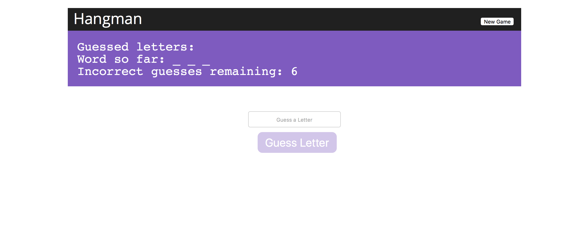

# Hangman Web Application

Hangman implemented in Elm.



## Installation

Ensure that you're running Node v.6.x.0 or greater as well as have the latest npm release running in your local environment. Clone the repository down by typing:

`git clone https://github.com/churchie317/hangman.git`.

Once downloaded, cd into the newly created repository and download the project's dependencies by typing:

 `npm install`.

 Once the dependencies have finished installing, type:

 `npm start`

 to build the application's bundle and start up the local server. You may be prompted to download some Elm dependencies during the installation process. In that case simply press return to continue. When finished, open up a web browser and navigate to:

 `http://localhost:3333`

 to begin playing.

Enjoy!

## File and Code Structure

```
package.json
server.js
src
  \-- index.html
  \-- styles.css
  \-- elm-package.json
  \-- project
    \-- Main.elm
    \-- Hangman.elm
    \-- elm-package.json
    \-- tests
      \-- Main.elm
      \-- Tests.elm
      \-- elm-package.json
elm-package.json
```

Most of the project's code can be found in the src/ and src/project directories. `index.html` represents the project's main entry point and reset.css and styles.css contain the project's stylesheets. In the project's src/project directory, `Main.elm` represents Elm's entry point into the app while the bulk of the project code is located in `Hangman.elm`. Similarly, `Main.elm` in the src/project/tests directory represents the tests' located in `Tests.elm`. These tests can be run by typing:

`npm t` or `npm run test`.

A note on file size in Elm:
When coding in JavaScript, I generally prefer to break large files into smaller, more digestible modules. It is a convention in Elm, however, to allow files to grow very large before breaking them into their own modules. Therefore, I have decided to follow the community's advice by choosing to keep Hangman.elm ~300 lines.

## Design Decisions

Rather than attempt any extensions, I have elected to demonstrate my passion for programming by writing this application in a new (to me, anyway) language. I've been experimenting with functional programming in JavaScript for sometime now, so I was happy to learn a new language that leveraged its power.
